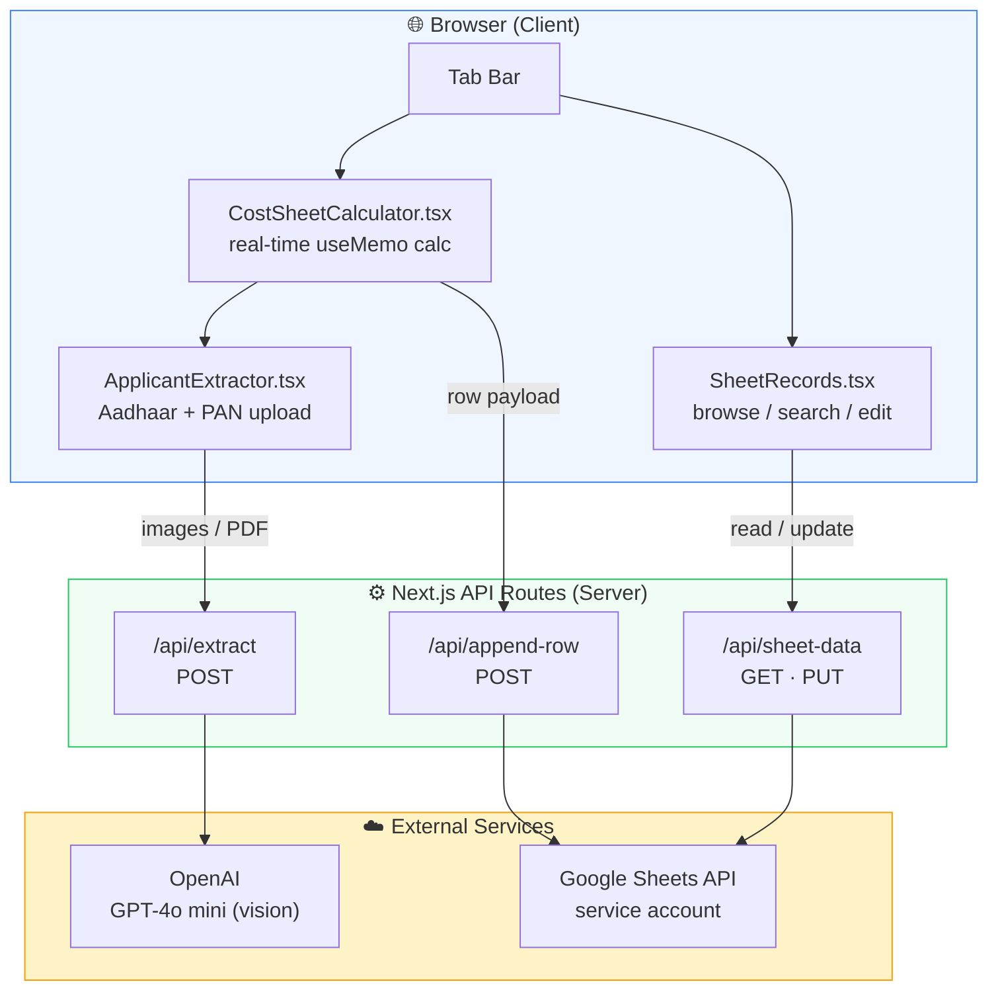
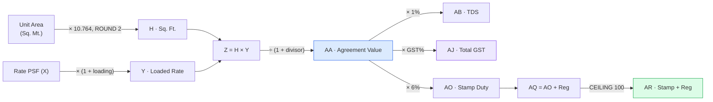
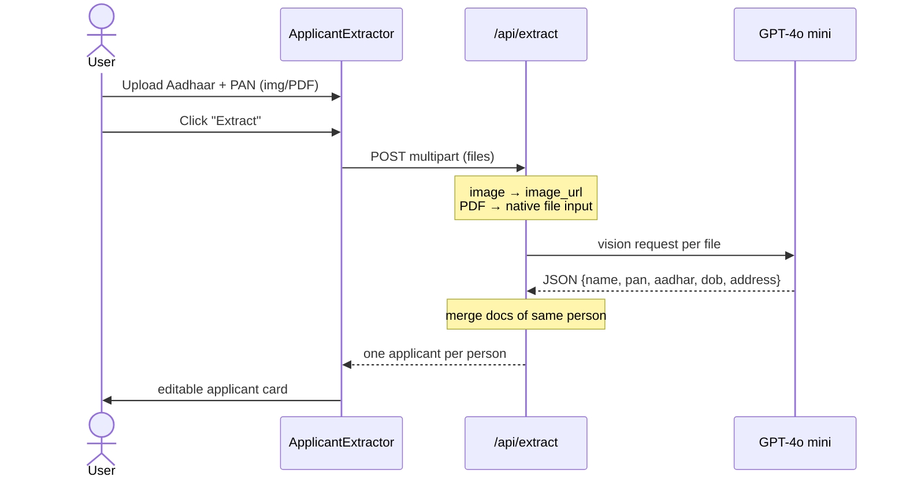
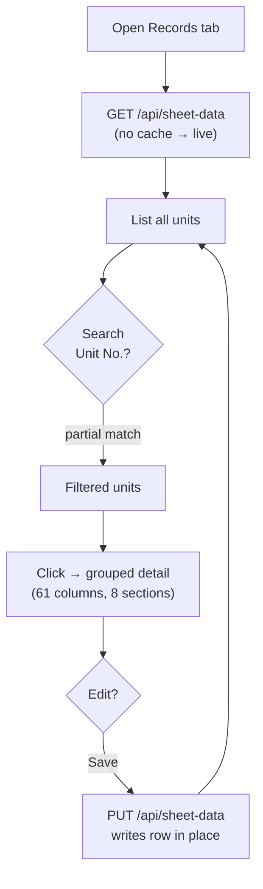

# 🏢 Cost Sheet Calculator — Superb Altura

A Next.js web app for **real-estate inventory pricing**. It calculates a unit's full cost sheet (agreement value, TDS, GST, stamp duty) with **100% formula-accuracy to the source Excel**, extracts applicant KYC from **Aadhaar/PAN cards using AI**, and reads/writes records to a **live Google Sheet**.

---

## ✨ Features

| Feature | Description |
|---|---|
| 🧮 **Cost Sheet Calculator** | Real-time, Excel-accurate calculation of 22 derived columns (Y → AR) for two unit types |
| 🪪 **AI KYC Extraction** | Upload Aadhaar + PAN (image **or** scanned PDF) → GPT-4o mini reads name, PAN, Aadhaar, DOB, address |
| 👥 **Multi-applicant** | One block per applicant; "Add Applicant" for co-applicants |
| 📤 **Append to Google Sheet** | One click writes the full 61-column row to a connected sheet |
| 📋 **Sheet Records tab** | Browse & search live sheet data by Unit No., with grouped detail view |
| ✏️ **In-place editing** | Edit any record's columns and save back to the sheet |

---

## 🏗️ Architecture



---

## 🧮 Calculation Pipeline

Each input flows through a fixed formula chain. Internal math uses **scaled-integer arithmetic** to avoid floating-point drift, so results match the Excel sheet to the rupee.



### Per-unit configuration

| Parameter | 🏪 Shop (Ground) | 🏢 Office (3rd Floor) |
|---|---|---|
| Loading factor | +7% | +13% |
| AA divisor | ÷ 1.12 | ÷ 1.18 |
| GST rate | 12% | 18% |
| Stamp duty | 6% | 6% |

> ✅ Verified against the source Excel with **8.5 million fuzz assertions** — zero mismatches.

---

## 🪪 KYC Extraction Flow



One **block = one applicant** — the Aadhaar and PAN uploaded together are always combined into a single record (no fragile name-matching).

---

## 📋 Sheet Records — Read / Search / Edit



---

## 🛠️ Tech Stack

- **Next.js 15** (App Router) · **React 19** · **TypeScript**
- **Tailwind CSS**
- **OpenAI** `gpt-4o-mini` (vision) for KYC OCR
- **googleapis** (Sheets v4) via service account

---

## 🚀 Getting Started

### 1. Install

```bash
npm install
```

### 2. Configure environment

Copy the template and fill in real values:

```bash
cp .env.example .env.local
```

| Variable | Where to get it |
|---|---|
| `OPENAI_API_KEY` | platform.openai.com → API keys |
| `GOOGLE_SHEET_ID` | from the sheet URL: `docs.google.com/spreadsheets/d/`**`<ID>`**`/edit` |
| `GOOGLE_SERVICE_ACCOUNT_EMAIL` | Google Cloud → Service Account → email |
| `GOOGLE_PRIVATE_KEY` | Service Account JSON → `private_key` |

> ⚠️ **Share the Google Sheet** with the service-account email (Editor access).

### 3. Run

```bash
npm run dev      # http://localhost:3000
npm run build    # production build
```

---

## 📁 Project Structure

```
src/app/
├─ page.tsx                      # Tab shell (Calculator | Records)
├─ CostSheetCalculator.tsx       # Calculator + Append to Sheet
├─ components/
│  ├─ ApplicantExtractor.tsx     # Aadhaar/PAN upload + AI extraction
│  └─ SheetRecords.tsx           # Browse / search / edit records
└─ api/
   ├─ extract/route.ts           # OpenAI KYC extraction
   ├─ append-row/route.ts        # Append row to sheet
   └─ sheet-data/route.ts        # GET (read) + PUT (update)
```

---

## 🔒 Security

- Secrets live only in `.env.local` and `AFS_Verification_GS.json` — **both git-ignored**.
- Google access uses a **service account** (no end-user OAuth).
- The app never logs or exposes credentials to the client.

---

## 📜 License

Private / internal use.
